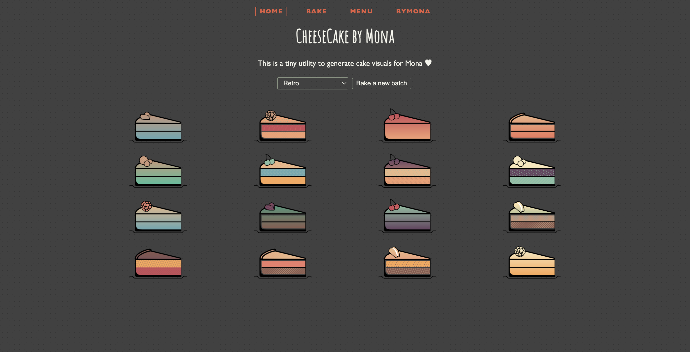
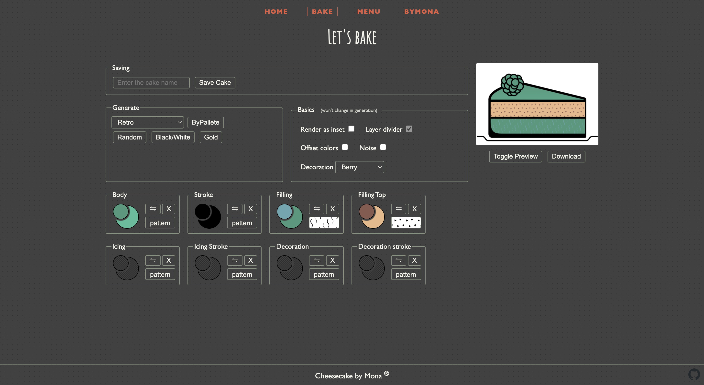
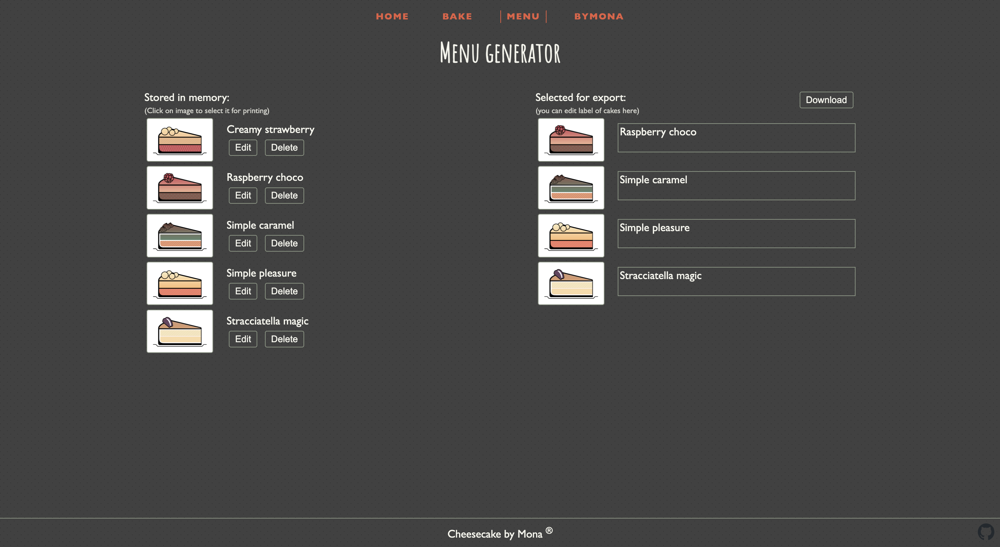

# CheeseCake-by-Mona

a tiny utility to help create quick cake menus :)


## Home screen
random 16 cakes are generated on each page opening, you can change paletter and re-render whole set as often as you want. It's a good quick helper to find a nice design. Once you like some cake in here, you can click on it and edit in in 'Bake' section.



## Bake

Randomizer and adjustment screen to fine tune your designs. For each part of the cake you can select 2 colours, which define linear gradient, or you can pick a patter to be applied using these colors. Color and pattern fields also work as drag&drop areas for a quick manipulation. As core design attributes may not be that interesting to change, 'Basics' section is not changed during randomization.



## Menu
In menu you see all saved designs on the left side of the screen, clicking on cake pictogram you can add it to a final 'menu'. This is handy when you have set of well known recipes and you just need to reuse them and alter caption (e.g. you need localized menu), without changing your original set. Once you're satisfied, menu can be downloaded as SVG.



## Editing hints

All patterns are generated as SVG patterns, which are not well supported in some editors, but browsers seems to have no issues rendering these. [Inkscape](https://inkscape.org/) threats them really well, so if you'd like to play with rendered font and background, I suggest to use it :).


## Developing

Project is created using [sveltekit](https://kit.svelte.dev) and it was really nice to work with it. 
Once you've installed dependencies with `npm install` (or `pnpm install` or `yarn`), start a development server:

```bash
npm run dev

# or start the server and open the app in a new browser tab
npm run dev -- --open
```

## Building

To create a production version of your app:

```bash
npm run build
```

There are also some changes to publish page directly to github pages, so anytime you do your `npm run build`, don't forget to push generated static files too.